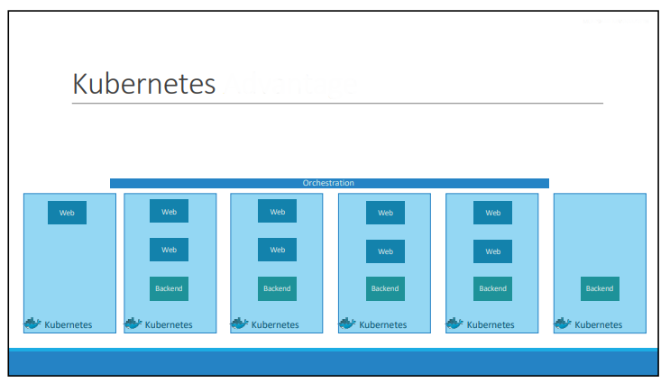
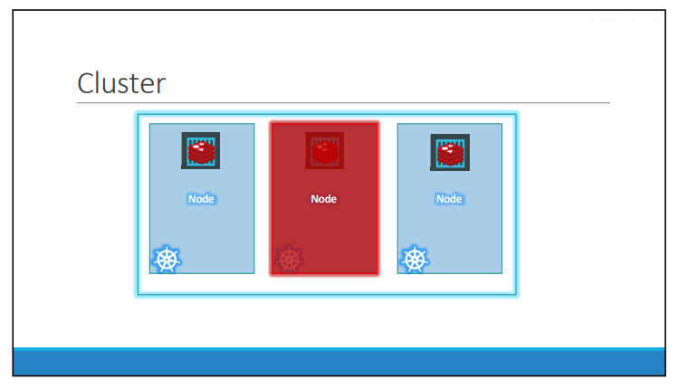

**1. What are containers?**

Containers are completely isolated environments, as in they
	can have their own processes or services, their own network interfaces, 	their own mounts, just like Virtual machines, except that they all share 		the same OS kernel.

**2. Container vs image**

An image is a package or a template, just like a VM template that you might have worked with in the virtualization world. It is used to create one or more containers.

Containers are running instances off images that are isolated and have their own environments and set of processes.

	
**3. What is Container Orchestration?**

If our application relies on other containers such as database or messaging services or other backend services, Then if the number of users increase and we need to scale our application. We would also like to scale down when the load decreases.To enable these functionalities you need an underlying platform with a set of resources. The platform needs to orchestrate the connectivity between the containers and automatically scale up or down based on the load. This whole process of automatically deploying and managing containers is known as Container Orchestration.

**4. What is kubernetes?**

It is a **Container Orchestration** technology used to orchestrate the 		deployment and management of of containers in a clustered environment.
	
**5. What is Cluster?**

A cluster is a set of nodes grouped together. This way even if one node fails our application still accessible from the other nodes.

